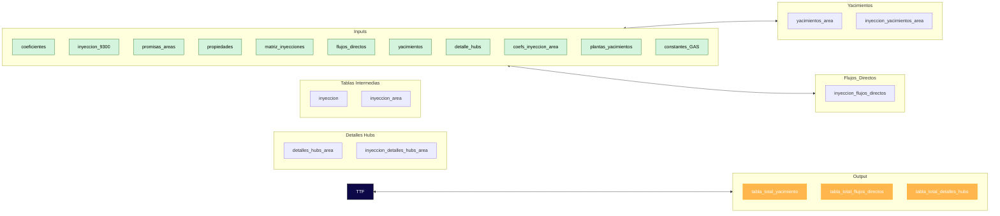

```mermaid


flowchart LR


    subgraph Detalles Hubs
        DHA[detalles_hubs_area]
        IDHA[inyeccion_detalles_hubs_area]
    end

    subgraph Flujos_Directos
        IFD[inyeccion_flujos_directos]
    end

    subgraph Yacimientos
        YA[yacimientos_area]
        IYA[inyeccion_yacimientos_area]
    end

    subgraph Tablas Intermedias
        I[inyeccion]
        IA[inyeccion_area]
    end


    subgraph Inputs
      direction TB
      COEFS[coeficientes]
      I9300[inyeccion_9300]
      PA[promisas_areas]
      PROPS[propiedades]
      MI[matriz_inyecciones]
      FD[flujos_directos]
      Y[yacimientos]
      DH[detalle_hubs]
      CIA[coefs_inyeccion_area]
      PY[plantas_yacimientos]
      CTESGAS[constantes_GAS]
    end

    subgraph Output
        TTY[tabla_total_yacimiento]
        TTFD[tabla_total_flujos_directos]
        TTDH[tabla_total_detalles_hubs]
    end

    TTF <--> Output

    Inputs <--> Yacimientos
    Inputs <--> Flujos_Directos

    classDef input fill:#d4f4dd,stroke:#2e7d32,color:#000;
    classDef output fill:#FFB74D,color:#FFF,stroke:#FFA500;
    classDef output_final fill:#0D0847,color:#FFF,stroke:#000;
    class TTF output_final;
    class TTY,TTFD,TTDH output;
    class COEFS,I9300,PA,PROPS,MI,FD,Y,DH,CIA,PY,CTESGAS input;

```
